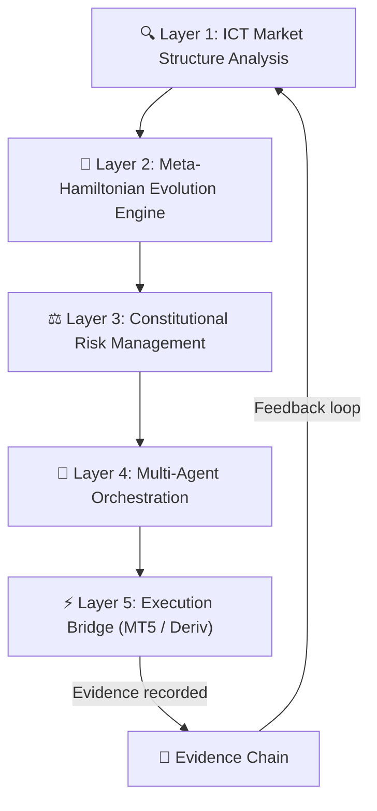
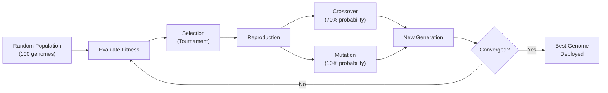
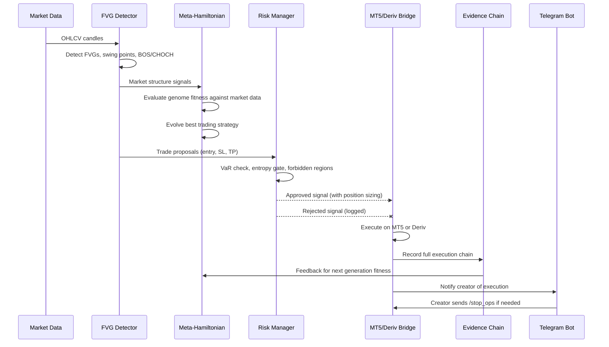

# Apex Quantum ICT — System Architecture & Algorithm Walkthrough

## What Is This System?

**Apex Quantum ICT** is an **autonomous, self-improving trading platform** that combines three ideas:

1. **ICT (Inner Circle Trader) market structure analysis** — detecting Fair Value Gaps, swing points, and Break-of-Structure/Change-of-Character events in price data.
2. **Evolutionary computation (the "God Hamiltonian")** — a genetic algorithm engine that _evolves entire trading strategies_ as graph-based genomes, using Hamiltonian Monte Carlo dynamics.
3. **Constitutional governance** — a hard-coded set of inviolable rules (no martingale, no grid trading, entropy gates, risk limits) that every trade must pass through before execution.

All of this is wrapped in a **multi-agent framework** (7 specialized AI agents coordinated by an Orchestrator), connected to real brokers (MT5/Deriv) via execution bridges, and controllable remotely via **Telegram chat-ops**.

---

## The Five Layers



---

## Layer 1 — ICT Market Structure Analysis

> **Files**: [fvg_detector.py](file:///c:/Users/Dataentry/CascadeProjects/apex_quantum_ict/ict_fvg/fvg_detector.py)

This is the **eyes** of the system — it reads raw OHLCV candle data and extracts ICT concepts.

### What It Detects

| Concept | How It Works |
|---|---|
| **Fair Value Gaps (FVGs)** | The classic 3-candle ICT pattern: a gap between candle 1's wick and candle 3's wick that candle 2 didn't fill. Detected as either **Bullish** (gap below price) or **Bearish** (gap above price). |
| **Swing Highs / Lows** | A candle whose high (or low) is greater (or lower) than `N` candles on both sides. Labeled HH, HL, LH, LL relative to the previous swing. |
| **BOS (Break of Structure)** | Price continues the prevailing trend by breaking the prior swing high (bullish) or low (bearish). |
| **CHOCH (Change of Character)** | Price _reverses_ through a swing level — the first break against the trend direction. Signals a potential trend change. |

### How FVGs Are Scored

Each FVG is scored by **strength** = `gap_size / ATR(14)`. A gap that's 2× the average true range is much more significant than one that's 0.1×. FVGs also track a **lifecycle**:

```
ACTIVE → MITIGATION_STARTED → FILLED or EXPIRED
```

- **ACTIVE**: The gap exists and hasn't been touched.
- **MITIGATION_STARTED**: Price has re-entered the gap zone.
- **FILLED**: Price has fully crossed through the gap.
- **EXPIRED**: The gap is too old (100+ bars) and is discarded.

### Trade Proposal Generation

The detector's `get_trade_proposals()` method generates concrete trade ideas:

- **Bullish FVG** → BUY when price retraces into the gap. Stop-loss = 1 ATR below the gap bottom. Take-profit = 2R.
- **Bearish FVG** → SELL when price retraces into the gap. Stop-loss = 1 ATR above the gap top. Take-profit = 2R.

Proposals are sorted by descending strength score.

---

## Layer 2 — Meta-Hamiltonian Evolution Engine ("God Hamiltonian")

> **Files**: [meta_hamiltonian.py](file:///c:/Users/Dataentry/CascadeProjects/apex_quantum_ict/god_hamiltonian/meta_hamiltonian.py) · [algorithm_genome.py](file:///c:/Users/Dataentry/CascadeProjects/apex_quantum_ict/god_hamiltonian/algorithm_genome.py) · [population.py](file:///c:/Users/Dataentry/CascadeProjects/apex_quantum_ict/god_hamiltonian/population.py) · [mutation.py](file:///c:/Users/Dataentry/CascadeProjects/apex_quantum_ict/god_hamiltonian/mutation.py) · [crossover.py](file:///c:/Users/Dataentry/CascadeProjects/apex_quantum_ict/god_hamiltonian/crossover.py) · [selection.py](file:///c:/Users/Dataentry/CascadeProjects/apex_quantum_ict/god_hamiltonian/selection.py) · [fitness_ledger.py](file:///c:/Users/Dataentry/CascadeProjects/apex_quantum_ict/god_hamiltonian/fitness_ledger.py)

This is the **brain** — the system that makes the platform _self-improving_.

### The Core Idea

Instead of hard-coding a single trading strategy, the system **evolves populations of strategies**. Each strategy is represented as a **directed acyclic graph (DAG)** called an `AlgorithmGenome`:

- **Nodes** = one of 8 "constitutional operators": `observe`, `propose`, `project`, `measure_delta_s`, `schedule`, `execute`, `reconcile`, `evidence`
- **Edges** = data flow between operators (weighted, typed, with optional delay)
- **Parameters** = per-node tuning (risk tolerance, confidence thresholds, learning rates, stop-loss distances, etc.)

### The 8 Constitutional Operators (the "Lawful Cycle")

These are the 8 stages every trading algorithm _must_ contain:

| # | Operator | Purpose |
|---|---|---|
| 1 | **Observe** | Ingest market data — candles, orderbook, news |
| 2 | **Propose** | Generate candidate trade signals from observed data |
| 3 | **Project** | Forward-simulate or forecast the impact of each proposal |
| 4 | **Measure ΔS** | Compute entropy change — every state transition must increase system entropy by ≥ 0.01 |
| 5 | **Schedule** | Decide _when_ to execute (timing, urgency, market session) |
| 6 | **Execute** | Send the order to the broker |
| 7 | **Reconcile** | Compare expected vs. actual outcome; update beliefs |
| 8 | **Evidence** | Log the entire decision chain immutably |

> [!IMPORTANT]
> Every genome is **validated at construction time** — it must contain at least one `observe` and one `evidence` node, must be acyclic, and operators must be from the valid set. Non-compliant genomes are rejected.

### How Evolution Works



1. **Initialize**: Create 100 random genomes (or resume from checkpoint).
2. **Evaluate**: Score each genome on:
   - **Structure fitness**: Does it have all 8 operator types? Are the layers balanced? Is connectivity optimal (~3 edges per node)?
   - **Parameter fitness**: Are risk/confidence thresholds in reasonable ranges?
   - **Complexity penalty**: Overly complex genomes are penalized.
3. **Select**: Tournament selection picks parents.
4. **Reproduce**: Crossover (swap subgraphs between parents) and mutation (tweak parameters, add/remove nodes).
5. **Elitism**: Top 10% survive unchanged.
6. **Repeat**: Every 10 generations, checkpoint to disk. Best genome saved after every generation.

### Hamiltonian Monte Carlo (HMC)

The HMC step uses physics-inspired sampling to explore the algorithm space. It treats the parameter space as a physical system with position (current parameters) and momentum (exploration direction), and uses leapfrog integration to take efficient steps through the landscape without random-walking.

---

## Layer 3 — Constitutional Risk Management

> **Files**: [risk_management.py](file:///c:/Users/Dataentry/CascadeProjects/apex_quantum_ict/core/risk_management.py) · [forbidden_regions.py](file:///c:/Users/Dataentry/CascadeProjects/apex_quantum_ict/core/constraints/forbidden_regions.py)

This is the **immune system** — it prevents the platform from self-destructing.

### The 5 Constitutional Constraints

| Constraint | Rule | Effect |
|---|---|---|
| **Entropy Gate** | Every state transition must have ΔS ≥ 0.01 | Prevents stagnation and ensures the system is always learning |
| **VaR Limit** | 95% Value-at-Risk must stay below 2% of capital | Caps maximum possible loss per trade |
| **Forbidden Regions** | Strategies containing `martingale`, `grid`, `arbitrage`, or `doubling` are **banned** | Prevents catastrophic blow-up strategies |
| **Scheduler Sovereignty** | The risk manager reports to the scheduler — it never self-authorizes trades | Separation of concerns |
| **Audit-First** | Every risk decision is persisted as a JSON evidence file | Full traceability |

### Risk Level Classification

```
SAFE → CAUTION → WARNING → CRITICAL → COLLAPSE
```

- **SAFE**: VaR < 50% of limit, drawdown < 50% of max
- **COLLAPSE**: VaR exceeded or drawdown > 20% → **all trading halted**

### Position Sizing

Uses **Half-Kelly Criterion** scaled by risk level:
- SAFE: 100% of Kelly size
- CAUTION: 75%
- WARNING: 50%
- CRITICAL: 25%
- COLLAPSE: 0% (close everything)

### Circuit Breaker

An emergency kill switch that triggers on:
- VaR > 5%
- Drawdown > 15%
- 5 consecutive losing trades

Once triggered, **all trading halts until manual reset**.

---

## Layer 4 — Multi-Agent Orchestration

> **Files**: [orchestrator_agent.py](file:///c:/Users/Dataentry/CascadeProjects/apex_quantum_ict/agents/orchestrator_agent.py) · [telegram_notification_agent.py](file:///c:/Users/Dataentry/CascadeProjects/apex_quantum_ict/agents/telegram_notification_agent.py) · + 5 other agent files

This is the **nervous system** — 7 specialized agents coordinated by an orchestrator.

### The 7 Agents

| Agent | Role |
|---|---|
| **Orchestrator** | The conductor — assigns tasks, manages dependencies, runs the execution loop |
| **Prompt Generator** | Generates contextual prompts for LLM-assisted analysis |
| **Superpowers** | Implements advanced mathematical extensions (quantum phase space, path integrals) |
| **Manus Planning** | Strategic planning and roadmap management |
| **Clank** | Execution kernel — admissibility checking, formal verification |
| **Codebase Prompting** | Repository analysis and context retrieval |
| **Marketplace** | Plugin ecosystem and co-evolution of competing strategies |

### How Orchestration Works

1. Tasks are loaded from the enhancement roadmap (prioritized, with dependencies).
2. The orchestrator finds tasks whose dependencies are met.
3. It matches each task to the appropriate agent by type.
4. Each agent runs as a subprocess with environment variables set.
5. Results are saved as JSON; the orchestrator tracks completion.

### Telegram Command & Control

The Telegram agent provides **two-way communication**:

| Command | Action |
|---|---|
| `/status` | Get system & agent health |
| `/trade_status` | Get current positions and equity |
| `/start_ops` | Start the autonomous Lawful Cycle loop |
| `/stop_ops` | Graceful shutdown |
| `/sys_update` | Trigger self-optimization via Clank |
| `/help` | List commands |

It also sends **proactive notifications** on agent starts, completions, errors, and system events — rate-limited to prevent spam.

---

## Layer 5 — Execution Bridge

> **Files**: [mt5_bridge.py](file:///c:/Users/Dataentry/CascadeProjects/apex_quantum_ict/core/execution/mt5_bridge.py) · [main_operational.py](file:///c:/Users/Dataentry/CascadeProjects/apex_quantum_ict/main_operational.py)

This is the **hands** — the part that actually places trades on real brokers.

### MT5 Bridge Pipeline

Every trade signal passes through a 5-step pipeline:

```
Signal → Risk Validation → Constitutional Check → Order Execution → Evidence Recording
```

1. **Risk Validation**: Volume limits, leverage checks.
2. **Constitutional Admissibility**: `constitutional_score` must be ≥ 0.30.
3. **Execution**: If connected to a real MT5 terminal, sends a real order. Otherwise, simulates.
4. **Evidence**: Every execution (success or failure) is recorded with full signal metadata.

### Deriv API Integration

The system also connects to **Deriv** via WebSocket (`wss://ws.binaryws.com`), supporting:
- Account authorization
- Balance queries
- Contract proposals (CALL/PUT with duration and stake)
- Contract purchases
- Tick stream subscriptions

### The FastAPI Application

The whole system is served as a web application ([main_operational.py](file:///c:/Users/Dataentry/CascadeProjects/apex_quantum_ict/main_operational.py)):
- Login/registration with session tokens
- Trading dashboards (multiple HTML frontends)
- REST APIs for both MT5 and Deriv operations
- Mathematical framework runtime display
- WebSocket support for real-time data

---

## End-to-End Data Flow

Here's what happens when the system is running autonomously:



---

## Summary

| Aspect | Implementation |
|---|---|
| **Market Analysis** | ICT Fair Value Gaps, swing points, BOS/CHOCH — ATR-normalized strength scoring |
| **Strategy Discovery** | Genetic evolution of graph-based trading algorithms using Hamiltonian Monte Carlo |
| **Risk Control** | VaR-based position sizing, circuit breakers, forbidden strategy bans, entropy gates |
| **Governance** | 8-operator constitutional cycle (observe → evidence), immutable audit trail |
| **Execution** | Dual-broker support (MT5 + Deriv), WebSocket real-time feeds, admissibility gating |
| **Self-Improvement** | Population evolution with checkpointing, best-genome persistence, convergence detection |
| **Remote Control** | Telegram bot with bidirectional command/notification interface |
| **Deployment** | FastAPI web app, Docker/K8s ready, GPU-acceleratable |
